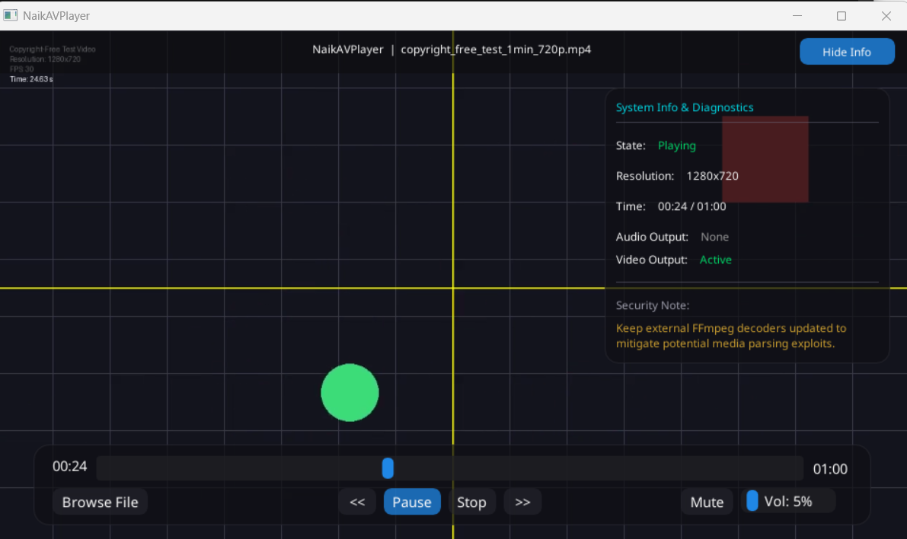

# NaikAVPlayer

A native, multi-threaded C++ media engine and video player built for extreme performance, low memory footprint, and zero-latency seek responsiveness.



Built on top of barebones **FFmpeg**, **SDL2**, and **Dear ImGui**, **NaikAVPlayer** implements container parsing, frame rescaling, and sub-frame clock synchronization directly on raw texture planes with no external wrapper overhead.

---

## Key Features

- 🏎️ **Symmetric Seeking:** Near-instantaneous forward and backward seeks without deadlocks or frames freezing.
- ⚙️ **Dynamic Hardware Fallback:** Seamlessly attempts hardware-accelerated H.264 decoding (Intel QSV, NVIDIA CUVID, D3D11VA, DXVA2, VAAPI, or V4L2M2M depending on OS), falling back dynamically to the software `h264` decoder on failure (e.g. driverless or virtualized systems) to prevent playback disruptions.
- ⏱️ **Audio-Video Synchronization:** Sub-frame accurate clock sync maintaining frame drift under `10ms` relative to the audio device master timeline.
- 🎛️ **Software Volume Controls:** Software audio sample attenuator with dynamic byte scaling, including a zero-overhead mute/bypass layout.
- 🔁 **Loop Playback Mode:** Toggle continuous replay (via the Loop control button or the `L` hotkey) to automatically seek back to the start on reaching end-of-file instead of stopping — ideal for kiosks, demos, and long-running validation.
- 📂 **Flexible Media Loading:** Supports drag-and-drop file ingestion directly onto the player window, or custom local file system parsing.
- 🗂️ **Native File Picker:** Cross-platform native OS file dialog powered by **nativefiledialog-extended (NFD)** — uses the Win32 File Explorer on Windows and GTK3/Portal on Linux.
- 📊 **Diagnostics HUD:** Real-time HUD diagnostics overlay displaying player states, playback clock offsets, media metadata, resolution metrics, and a security note warning for decoder maintenance.
- 🎨 **Modern Glassmorphic GUI with Vector Icons:** Floating dock and cinematic header layouts with a frosted translucent obsidian design, circular progress grabs, interactive welcome onboarding cards, toggleable HUD sidebars, and **programmatically-rendered vector control icons** (Play, Pause, Stop, Seek, Volume, Loop, Browse) featuring neon cyan hover highlights and accessibility tooltips.
- 🔤 **Bundled Open-Source Typography:** Integrated with **Noto Sans** fonts (SIL Open Font License 1.1) scanned dynamically from relative and installed system paths, avoiding system-dependent proprietary lookups.
- 🖼️ **Window Branding:** Branded with a custom high-fidelity app icon loaded natively as the SDL2 window and taskbar icon.
- 🧪 **100% Logic Test Coverage:** A fully instrumented functional integration and white-box test suite executing 100% of the player's core playback controller, demuxer, and audio/video decoder logical lines.

---

## Key Performance Indicators (KPIs)

To maintain extreme performance and rendering accuracy, the core engine adheres to strict engineering targets:
- ⏱️ **Audio-Video Drift (`< 10ms`):** Frame-alignment threshold relative to the audio device master clock timeline. If the video frame PTS lags by more than 10ms (`timeNow - 0.010` in `main.cpp`), the player enters a fast-forward decode loop to drop late frames and catch up instantly.
- 🏎️ **Seek Latency (`< 80ms`):** Average seek-to-keyframe catch-up response under normal workloads. The player immediately flushes packet queues and codec caches, then deactivates seeking catch-up once the current frame PTS is within 80ms (`timeNow - 0.080` in `main.cpp`) of the target seek clock.
- 🧪 **Code Quality (`100.00%`):** Unit and integration test line coverage on all core playback, demuxing, and decoding engine files (`AudioDecoder.cpp`, `VideoDecoder.cpp`, `Demuxer.cpp`, `PlayerController.cpp`, and `ThreadSafeQueue.hpp`).
- 🎛️ **Audio Attenuation:** Zero-overhead software attenuator bypass for mute and full volume states. Full volume (`volume >= 0.99f`) bypasses the scaling loop using `std::memcpy`; mute volume (`volume <= 0.01f`) bypasses the loop using `std::memset` to 0.

---

## Architecture

NaikAVPlayer follows the classic multi-threaded media player design: a demuxer thread, two decoder paths, and a render loop, coordinated through bounded thread-safe queues and a single source of truth for "what time is it."

### Thread Model

```
┌─────────────┐   packets   ┌──────────────────┐               ┌────────────────────┐
│             ├────────────►│  Video Queue     │──► Video      │ Decoded Frame      │──► Main/Render Loop
│   Demuxer   │             │ (AVPacket* [100])│    Decoder    │ Queue              │    (SDL YUV Texture)
│  (thread)   │             └──────────────────┘    (thread)   │ (DecodedFrame [8]) │
│             │                                                └────────────────────┘
│             │   packets   ┌──────────────────┐
│             ├────────────►│  Audio Queue     │──► AudioDecoder (decoded on-demand)
└─────────────┘             │ (AVPacket* [150])│    (SDL callback thread)
                            └──────────────────┘
```

- **Demuxer thread**: Reads raw packets via `av_read_frame` and routes them into bounded `ThreadSafeQueue<AVPacket*>` instances (video capacity: 100 packets, audio capacity: 150 packets).
- **Video decoder thread**: Dedicated background thread that pops packets from the video queue, decodes them (via hardware or software fallback), converts the frames, and pushes them into the bounded `m_decodedFrameQueue` (capacity: 8 frames).
- **Audio decoding**: Run sample-accurately inside the SDL audio callback thread. It pulls packets from the audio queue, decodes them to PCM, and feeds the output buffer.
- **Main / Render thread**: Peeks and pops decoded frames from `m_decodedFrameQueue` whose PTS is less than or equal to the current master clock time, updates the SDL YUV texture on the GPU, and renders the UI.
- The bounded queues use two condition variables (`m_cond_push`/`m_cond_pop`) so a full queue naturally stalls the producer (applying backpressure) without CPU spinning, and `abort()` cleanly wakes every blocked thread for shutdown.

#### GPU-Mapped Planar YUV Uploads
Instead of performing costly YUV-to-RGB color space conversions on the CPU, the video decoder pipeline extracts raw YUV 4:2:0 planar frame data directly. The main thread maps this data onto a hardware-accelerated SDL2 streaming texture (`SDL_PIXELFORMAT_IYUV`) using `SDL_UpdateYUVTexture`. This uploads the raw plane segments directly to GPU-mapped texture memory, allowing the graphics hardware to handle color space conversion and scaling efficiently.

#### Dynamic Hardware Decoder Fallback
To achieve optimal playback performance without sacrificing robustness, the video decoder pipeline employs a dynamic hardware-to-software fallback. At initialization, it queries and tries to open native hardware decoders (such as `h264_d3d11va`, `h264_dxva2`, `h264_qsv`, or `h264_cuvid` on Windows; `h264_vaapi`, `h264_v4l2m2m` on Linux). If a hardware decoder fails during initialization or encounters a fatal decoding or surface mapping error at runtime (e.g. running on driverless or virtualized headless environments), the decoder intercepts the failure, releases the hardware context, configures the software `h264` decoder, and resubmits the video packet. This guarantees a seamless transition with zero playback disruption or application crashes.

### Audio-Master Clock

Rather than syncing playback to system wall-clock time, the player treats **audio as the master clock** whenever an audio stream is present — the standard approach in production media players, since audio dropouts and clicks are far more perceptible to the ear than the eye is to a duplicated or dropped video frame.

The audio clock isn't just "the last decoded packet's timestamp." It's reconstructed sample-accurately:

```
audio_clock = base_pts_of_current_frame + (bytes_already_consumed_by_SDL / bytes_per_second)
```

`AudioDecoder::getAudioClock()` combines the PTS of the most recently decoded frame with how far the SDL audio callback has already progressed *into* that frame's buffer, giving sub-frame timing resolution rather than per-packet granularity. This is what makes the `<10ms` drift KPI meaningful rather than aspirational — the reference clock itself is precise enough to support that tolerance.

When there's no audio track, the controller falls back to a wall-clock-driven `m_videoClock` that advances using `steady_clock` deltas between render ticks (`updateClockForVideoOnly`), so video-only files still play at the correct rate.

### Catch-Up & Frame-Dropping Logic

The player ensures audio-video synchronization and low latency using a two-tier catch-up/frame-dropping model:

1. **Decoder-side Seek Catch-up (SeekCatchupMode)**:
   - When a seek is triggered, the player enters `SeekCatchupMode::LANDING` and starts a new epoch (`m_catchupEpoch`).
   - The video decoder thread rapidly decodes packets from the seek position but discards the frames without scaling or updating textures if their PTS is less than `m_catchupTarget - 0.005` (5ms threshold).
   - Once a frame at or past the target is successfully decoded, it is pushed to the decoded frame queue, and the catch-up mode is deactivated (`SeekCatchupMode::NONE`).
   - This discards stale pre-seek frames and ensures seeking finishes almost instantaneously.

2. **Render-side Frame-Dropping (Draining Queue)**:
   - In the main render thread, the player loop drains frames from the `m_decodedFrameQueue` whose PTS is less than or equal to the master clock (`timeNow`).
   - If rendering lags behind decoding, the loop pops and frees outdated frames (`av_frame_free`) in a single tick until it reaches the frame closest to/matching `timeNow`, avoiding video presentation lag.

### Seek Flow

1. UI thread calls `PlayerController::seek()` → pauses audio output, increments the catch-up epoch (`m_catchupEpoch`), sets the mode to `SeekCatchupMode::LANDING`, and clears the decoded frame queue immediately.
2. Demuxer thread independently calls `avformat_seek_file()` (binary-search index seek to the nearest keyframe) and signals the decoders.
3. Both decoders are flushed (`avcodec_flush_buffers`) to drop any cached reference frames from the old position.
4. Video decoder thread discards frames up to the seek target (`m_catchupTarget - 0.005`) during the catch-up landing phase.
5. Render loop displays the target frame as soon as it arrives, and audio is unpaused.

This clean seek lifecycle minimizes perceived seek latency — the player doesn't wait for in-flight decoding to finish before discarding old data.

### State Machine Transitions
The player playback engine is governed by a strict state machine to synchronize operations between threads:
* **`UNINITIALIZED`:** The player is empty. Loading a media file starts background demuxing and transitions the state to `OPENED`.
* **`OPENED`:** The media is loaded, and the decoders are prepared. The first frame is decoded and rendered on the screen immediately. Triggering `play()` transitions the state to `PLAYING`.
* **`PLAYING`:** Audio output is unpaused, and the main loop decodes and syncs video frames to the master clock.
* **`PAUSED`:** Playback is frozen. The audio device is paused to hold the current clock position.
* **`ENDED`:** Reached when the demuxer hits EOF and all packet queues are fully drained. The audio device is paused. Seeking back (e.g., `seek(0.0)`) or playing transitions the engine back to active states. If **Loop Mode** is enabled, this transition is bypassed entirely — reaching EOF while `PLAYING` instead calls `seek(0.0)` directly, reusing the same flush/clock-reset pipeline as a manual seek, and playback continues without ever entering `ENDED`.
* **`ERROR_STATE`:** Entered if demuxing or stream initialization fails, prompting safe release of resources.

---

## Tech Stack & Dependencies

- **C++17** (compiled with GCC/MinGW)
- **FFmpeg 8.x (avcodec, avformat, avutil, swscale, swresample)** (automatically downloaded LGPL-shared binaries)
- **SDL2** (automatically fetched and dynamically compiled)
- **Dear ImGui** (automatically fetched and statically compiled)
- **nativefiledialog-extended (NFD)** (fetched and compiled dynamically for cross-platform native file dialogs — zlib license)
- **Noto Sans Font** (bundled open-source SIL OFL 1.1 font files)
- **App Icon Asset** (custom-designed PNG and BMP formats)
- **ccache** (Optional: recommended compiler caching tool to accelerate clean compiles and CI workflows)

---

## Supported Media Formats

Thanks to its barebones FFmpeg demuxer and decoder integration, **NaikAVPlayer** supports a wide range of media containers and codecs, including:

- **Video Containers:** `.mp4`, `.mkv`, `.avi`, `.mov`, `.webm`, `.flv`
- **Audio Containers:** `.mp3`, `.wav`, `.ogg`, `.flac`, `.aac`
- **Video Codecs:** H.264 (AVC), H.265 (HEVC), VP8, VP9, MPEG-4
- **Audio Codecs:** AAC, MP3, Vorbis, FLAC, PCM

---

## Installation & Compilation

The project is natively cross-platform and compiles under **Windows** (via MinGW-w64 GCC) and **Linux** (via GCC).

The build system supports a custom `PLATFORM` configuration variable:
- **`AUTO`** (default): Automatically detects the host operating system.
- **`WINDOWS`**: Explicitly configures the project to build for Windows (links Win32 subsystems, fetches and copies FFmpeg DLLs).
- **`LINUX`**: Explicitly configures the project to build for Linux (links `pthread` and `dl`).

### Prerequisites

#### Windows
Ensure you have **CMake (version 3.16+)** and **MinGW-w64 (GCC)** configured on your path. 

The project features a **fully automated setup** for Windows: CMake will automatically download, extract, and configure the correct pre-compiled FFmpeg shared binaries package in the `thirdparty/ffmpeg` folder.

#### Linux
Install the development libraries via your package manager (e.g. `apt` on Ubuntu):
```bash
sudo apt-get update
sudo apt-get install -y libsdl2-dev libavcodec-dev libavformat-dev libavutil-dev libswscale-dev libswresample-dev
```

For the native file dialog to compile and work, ensure the GTK3 development library is installed:
```bash
sudo apt-get install -y libgtk-3-dev
```

---

### Step 1: Configure the Project

Generate the build configurations:

**Auto-detect (Recommended):**
```bash
cmake -B build
```

**Explicitly Target Windows (MinGW):**
```bash
cmake -B build -G "MinGW Makefiles" -DPLATFORM=WINDOWS
```

**Explicitly Target Linux:**
```bash
cmake -B build -DPLATFORM=LINUX
```

**Cross-Compile for Windows on Linux:**
If you are on a Linux host (e.g. Ubuntu) and want to cross-compile for Windows, you can use the MinGW-w64 GCC toolchain:
```bash
# Install the cross-compiler
sudo apt-get install -y mingw-w64

# Configure CMake targeting Windows
cmake -B build-windows \
  -DPLATFORM=WINDOWS \
  -DCMAKE_SYSTEM_NAME=Windows \
  -DCMAKE_C_COMPILER=x86_64-w64-mingw32-gcc \
  -DCMAKE_CXX_COMPILER=x86_64-w64-mingw32-g++

# Build Windows binaries
cmake --build build-windows
```

---

### Step 2: Compile the Project

Build the primary player binary and the test suite:
```bash
cmake --build build
```
*Note: On Windows, a post-build recipe automatically copies the required FFmpeg shared DLLs, the SDL2 DLL, and the bundled assets directory directly into the compilation target folder so you can run the binaries immediately.*

---

### Step 3: Install the Application (Linux)

To install the application binaries, assets, desktop entry launcher, and system icons, run:
```bash
sudo cmake --install build
```
This registers **NaikAVPlayer** with the desktop environment launcher search and stores assets in system paths (`/usr/local/share/NaikAVPlayer`).

---

### Step 4: Uninstall the Application (Linux)

To completely remove the installed files and clean desktop launcher integration:
```bash
sudo cmake --build build --target uninstall
```

---

## Usage Guide

### Running the Player

Launch the compiled player executable or installed application:

**Windows (PowerShell):**
```powershell
.\build\NaikAVPlayer.exe
```

**Linux (Local Build):**
```bash
./build/NaikAVPlayer
```

**Linux (System-Wide Installed):**
You can launch **NaikAVPlayer** from your desktop environment applications menu or run:
```bash
NaikAVPlayer
```

Or pass a media file path directly as an argument:

**Windows:**
```powershell
.\build\NaikAVPlayer.exe "C:\Path\To\video.mp4"
```

**Linux (Local Build):**
```bash
./build/NaikAVPlayer "/home/user/Videos/video.mp4"
```

**Linux (System-Wide Installed):**
```bash
NaikAVPlayer "/home/user/Videos/video.mp4"
```

### Keyboard Shortcuts
- **`Spacebar`**: Toggle Play / Pause.
- **`Left Arrow`** ($\leftarrow$): Seek backward by 10 seconds.
- **`Right Arrow`** ($\rightarrow$): Seek forward by 10 seconds.
- **`L`**: Toggle Loop Mode on/off.
- **`Escape`**: Close and exit the player.

---

## Verification & Tests

The test video was programmatically generated for testing purposes and contains only synthetic audio and graphics.

### Running Tests Locally with CTest (Same as CI)

You can run the tests using standard CMake test driver commands.

#### 1. Standard Test Execution
Configure the project, build, and run tests via CTest:
```bash
# Configure and Build
cmake -B build -DCMAKE_BUILD_TYPE=Debug
cmake --build build

# Run tests via CTest (with verbose logs on failure)
ctest --test-dir build --output-on-failure
```

#### 2. Running with Address and Undefined Behavior Sanitizers (ASan/UBSan)
To catch memory leaks, out-of-bounds access, and undefined behavior, build with sanitizers enabled:
```bash
# Configure with Sanitizers
cmake -B build \
  -DCMAKE_BUILD_TYPE=Debug \
  -DCMAKE_CXX_FLAGS="-fsanitize=address,undefined -fno-omit-frame-pointer" \
  -DCMAKE_C_FLAGS="-fsanitize=address,undefined -fno-omit-frame-pointer" \
  -DCMAKE_EXE_LINKER_FLAGS="-fsanitize=address,undefined"

# Build
cmake --build build

# Run tests with Sanitizer instrumentation
ctest --test-dir build --output-on-failure
```

#### 3. Native Direct Execution
Alternatively, run the compiled test executable directly using the automatically generated test video:
```powershell
# Windows
.\build\NaikAVPlayer_tests.exe ".\assets\hd_test_video_with_audio.mp4"

# Linux
./build/NaikAVPlayer_tests "./assets/hd_test_video_with_audio.mp4"
```
Or use the `TEST_VIDEO_PATH` environment variable:
```powershell
# Windows (PowerShell)
$env:TEST_VIDEO_PATH=".\assets\hd_test_video_with_audio.mp4"
.\build\NaikAVPlayer_tests.exe

# Linux
export TEST_VIDEO_PATH="./assets/hd_test_video_with_audio.mp4"
./build/NaikAVPlayer_tests
```

### Code Coverage Statistics
To check the code coverage, run the tests and then generate the stats from the `build` directory:
```powershell
cd build
gcov -o CMakeFiles/NaikAVPlayer_tests.dir/tests/tests.cpp.obj ../src/AudioDecoder.cpp
gcov -o CMakeFiles/NaikAVPlayer_tests.dir/tests/tests.cpp.obj ../src/VideoDecoder.cpp
gcov -o CMakeFiles/NaikAVPlayer_tests.dir/tests/tests.cpp.obj ../src/Demuxer.cpp
gcov -o CMakeFiles/NaikAVPlayer_tests.dir/tests/tests.cpp.obj ../src/PlayerController.cpp
```
This generates `.gcov` files confirming **100.00% Line Coverage** for the core player logic engine.

### CI/CD Pipeline (GitHub Actions)

The project features an automated **GitHub Actions CI/CD pipeline** (configured in [.github/workflows/ci.yml](.github/workflows/ci.yml)) that runs on every commit (`push`) and pull request (`pull_request`).

The pipeline executes entirely on a Linux runner (`ubuntu-latest`) and performs the following verification steps:
- **C++ Compiler Warnings Check:** Compiles both targets with compiler warnings treated as errors (`-Werror`) for strict code quality.
- **Native Linux Build & Test:** Compiles the player and runs the test suite natively under Linux using GCC.
- **Sanitizers:** Re-compiles and runs the native test suite under AddressSanitizer (ASan) and UndefinedBehaviorSanitizer (UBSan) to check for memory safety and undefined behavior.
- **Static Analysis:** Performs static analysis using `cppcheck` on all C++ source files.
- **Windows Cross-Compilation:** Cross-compiles the application for Windows using the MinGW-w64 GCC toolchain (`x86_64-w64-mingw32-gcc`/`g++`).
- **Compiler Caching (`ccache`):** Employs `ccache` to cache compilation units globally, significantly reducing compile times for upstream dependencies (SDL2, ImGui, NFD) on subsequent workflow runs.

---

## Open-Source Attribution & Credits

NaikAVPlayer is published under the **MIT License**. It links dynamically and statically to the following libraries and assets:
- **FFmpeg** (Licensed under LGPL v3.0, ensuring full legal compliance with the application's permissive MIT license)
- **SDL2** (Licensed under the Zlib License)
- **Dear ImGui** (Licensed under the MIT License)
- **nativefiledialog-extended (NFD)** (Licensed under the Zlib License — Copyright © 2014-2020 Michael Labbé, Copyright © 2020-2024 btzy)
- **Noto Sans Font** (Licensed under the SIL Open Font License 1.1)
