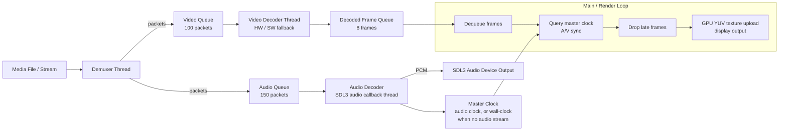

# NaikAVPlayer

[](https://github.com/sanjeev-naik/NaikAVPlayer/actions/workflows/ci.yml)
[](https://codecov.io/gh/sanjeev-naik/NaikAVPlayer)

NaikAVPlayer is a native, multi-threaded C++ media engine and video player built on raw FFmpeg APIs, SDL3, and Dear ImGui. It performs container parsing, software/hardware video decoding, sample-accurate audio resampling, and clock synchronization directly using GPU-mapped texture updates without intermediate frameworks. It targets low-latency seeking and sub-10ms audio-video clock synchronization using dedicated worker threads coordinated through bounded blocking queues, with a lock-free Single Producer Single Consumer (SPSC) ring for hot-path telemetry.


## Features

- **Symmetric Seeking:** Keyframe seek operations flushing packet queues and decoding pipelines under 80ms.
- **Dynamic Hardware Fallback:** Attempts initialization of platform-specific hardware decoders (D3D11VA, DXVA2, QSV, CUVID on Windows; V4L2M2M, VAAPI, QSV, CUVID on Linux), falling back dynamically to software H.264 decoding if hardware context allocation fails.
- **Audio-Video Synchronization:** Reconstructs audio clock sample-accurately from PCM sample offsets to maintain drift under 10ms.
- **Dynamic Resolution Scaling:** Real-time playback scaling supporting dynamic output resolution selection (Original source, 360p, 480p, 720p, 1080p, 1440p, 4K) from the UI dropdown to optimize rendering performance and GPU upload bandwidth.
- **Software Volume Attenuation:** Scalable audio output level adjustments with memcpy/memset bypasses for 100% and 0% volume states.
- **Loop Playback:** Wraparound seek to 0.0 upon reaching end-of-file for continuous playback.
- **Native File Dialog:** Cross-platform native file picker integration using nativefiledialog-extended (NFD) on Win32 and GTK3/Portal backends.
- **Pipeline Diagnostics & System Info HUD:** Real-time overlay displaying active player states, media telemetry (native vs. playback resolution, pixel format, hardware vs. software decoder type), pipeline queue depth levels, decode/render frame pacing budgets, and rolling clock synchronization offsets.
- **Translucent User Interface:** ImGui-based desktop interface using bundled Noto Sans typography.

---

## Architecture

NaikAVPlayer follows the classic multi-threaded media player design: a demuxer thread, two decoder paths, and a render loop, coordinated through bounded thread-safe queues and a single source of truth for "what time is it."

### Thread Model



- **Demuxer thread**: Reads raw packets via `av_read_frame` and routes them into bounded `ThreadSafeQueue<AVPacket*>` instances (video capacity: 100 packets, audio capacity: 150 packets).
- **Video decoder thread**: Dedicated background thread that pops packets from the video queue, decodes them (via hardware or software fallback), converts the frames, and pushes them into the bounded `m_decodedFrameQueue` (capacity: 8 frames).
- **Audio decoding**: Run sample-accurately inside the SDL3 Audio Stream callback thread. It pulls packets from the audio queue, decodes them to PCM, and feeds the output stream buffer.
- **Main / Render thread**: Peeks and pops decoded frames from `m_decodedFrameQueue` whose PTS is less than or equal to the current master clock time, updates the SDL YUV texture on the GPU, and renders the UI.
- The bounded queues use two condition variables (`m_cond_push`/`m_cond_pop`) so a full queue naturally stalls the producer (applying backpressure) without CPU spinning, and `abort()` cleanly wakes every blocked thread for shutdown.

#### GPU-Mapped Planar YUV Uploads
Instead of performing costly YUV-to-RGB color space conversions on the CPU, the video decoder pipeline extracts raw YUV 4:2:0 planar frame data directly. The main thread maps this data onto a hardware-accelerated SDL3 streaming texture (`SDL_PIXELFORMAT_IYUV`) using `SDL_UpdateYUVTexture`. This uploads the raw plane segments directly to GPU-mapped texture memory, allowing the graphics hardware to handle color space conversion and scaling efficiently.

#### Dynamic Hardware Decoder Fallback
To achieve optimal playback performance without sacrificing robustness, the video decoder pipeline employs a dynamic hardware-to-software fallback. At initialization, it queries and tries to open native hardware decoders (such as `h264_d3d11va`, `h264_dxva2`, `h264_qsv`, or `h264_cuvid` on Windows; `h264_vaapi`, `h264_v4l2m2m` on Linux). If a hardware decoder fails during initialization or encounters a fatal decoding or surface mapping error at runtime (e.g. running on driverless or virtualized headless environments), the decoder intercepts the failure, releases the hardware context, configures the software `h264` decoder, and resubmits the video packet. This guarantees a seamless transition with minimal playback disruption or application crashes.

### Audio-Master Clock

Rather than syncing playback to system wall-clock time, the player treats **audio as the master clock** whenever an audio stream is present — the standard approach in production media players, since audio dropouts and clicks are far more perceptible to the ear than the eye is to a duplicated or dropped video frame.

The audio clock isn't just "the last decoded packet's timestamp." It's reconstructed sample-accurately:

```
audio_clock = base_pts_of_current_frame + (bytes_already_consumed_by_SDL / bytes_per_second)
```

`AudioDecoder::getAudioClock()` combines the PTS of the most recently decoded frame with how far the SDL audio callback has already progressed *into* that frame's buffer, giving sub-frame timing resolution rather than per-packet granularity. This is what makes the `<10ms` drift target achievable rather than aspirational — the reference clock itself is precise enough to support that tolerance.

When there's no audio track, the controller falls back to a wall-clock-driven `m_videoClock` that advances using `steady_clock` deltas between render ticks (`updateClockForVideoOnly`), so video-only files still play at the correct rate.

### Catch-Up & Frame-Dropping Logic

The player ensures audio-video synchronization and low latency using a two-tier catch-up/frame-dropping model:

1. **Decoder-side Seek Catch-up (SeekCatchupMode)**:
   - When a seek is triggered, the player enters `SeekCatchupMode::LANDING` and starts a new epoch (`m_catchupEpoch`).
   - The video decoder thread rapidly decodes packets from the seek position but discards the frames without scaling or updating textures if their PTS is less than `m_catchupTarget - 0.005` (5ms threshold).
   - Once a frame at or past the target is successfully decoded, it is pushed to the decoded frame queue, and the catch-up mode is deactivated (`SeekCatchupMode::NONE`).
   - This discards stale pre-seek frames and ensures seeking finishes almost instantaneously.

2. **Render-side Frame-Dropping (Draining Queue)**:
   - In the main render thread, the player loop drains frames from the `m_decodedFrameQueue` whose PTS is less than or equal to the master clock (`timeNow`).
   - If rendering lags behind decoding, the loop pops and frees outdated frames (`av_frame_free`) in a single tick until it reaches the frame closest to/matching `timeNow`, avoiding video presentation lag.

### Seek Flow

1. UI thread calls `PlayerController::seek()` → pauses audio output, increments the catch-up epoch (`m_catchupEpoch`), sets the mode to `SeekCatchupMode::LANDING`, and clears the decoded frame queue immediately.
2. Demuxer thread independently calls `avformat_seek_file()` (binary-search index seek to the nearest keyframe) and signals the decoders.
3. Both decoders are flushed (`avcodec_flush_buffers`) to drop any cached reference frames from the old position.
4. Video decoder thread discards frames up to the seek target (`m_catchupTarget - 0.005`) during the catch-up landing phase.
5. Render loop displays the target frame as soon as it arrives, and audio is unpaused.

This clean seek lifecycle minimizes perceived seek latency — the player doesn't wait for in-flight decoding to finish before discarding old data.

### State Machine Transitions
The player playback engine is governed by a strict state machine to synchronize operations between threads:
* **`UNINITIALIZED`:** The player is empty. Loading a media file starts background demuxing and transitions the state to `OPENED`.
* **`OPENED`:** The media is loaded, and the decoders are prepared. The first frame is decoded and rendered on the screen immediately. Triggering `play()` transitions the state to `PLAYING`.
* **`PLAYING`:** Audio output is unpaused, and the main loop decodes and syncs video frames to the master clock.
* **`PAUSED`:** Playback is frozen. The audio device is paused to hold the current clock position.
* **`ENDED`:** Reached when the demuxer hits EOF and all packet queues are fully drained. The audio device is paused. Seeking back (e.g., `seek(0.0)`) or playing transitions the engine back to active states. If **Loop Mode** is enabled, this transition is bypassed entirely — reaching EOF while `PLAYING` instead calls `seek(0.0)` directly, reusing the same flush/clock-reset pipeline as a manual seek, and playback continues without ever entering `ENDED`.
* **`ERROR_STATE`:** Entered if demuxing or stream initialization fails, prompting safe release of resources.

---

## Performance Targets & Instrumentation

The player incorporates a lock-free Single Producer Single Consumer (SPSC) metric instrumentation framework that records and tracks execution times on the hot path without introducing synchronization locks or dynamic memory allocations. Automated benchmark publication is planned; targets are validated interactively via the --metrics HUD.

### Telemetry Metrics
- **A/V Sync Drift:** Design target: <10ms drift relative to the audio device master clock.
- **Seek Latency:** Design target: <80ms from seek command invocation to rendering target frame.
- **Queue Depths:** Monitored dynamically for packet and frame buffers (M1–M3).
- **Processing Budgets:** Gated time-series rings tracking demuxing, decoding, scaling, and GPU YUV upload durations (M4–M7, M9) to gauge real-time hardware bottlenecks.

---

## Build Instructions

The player is cross-platform and compiles natively under Linux (GCC) and Windows (MinGW-w64). It relies on CMake to retrieve and build dependencies automatically.

### Prerequisites

#### Linux
Install development packages using your package manager:
```bash
sudo apt-get update
sudo apt-get install -y libavcodec-dev libavformat-dev libavutil-dev libswscale-dev libswresample-dev libgtk-3-dev
```
*(SDL3, Dear ImGui, and nativefiledialog-extended are automatically retrieved from source and built during configuration).*

#### Windows (Native MinGW-w64)
Ensure CMake 3.16+ and MinGW-w64 GCC are configured on the path. The build system automatically downloads and verifies the correct month-end FFmpeg shared release package.

---

### Step 1: Configure the Project

**Auto-detect (Default):**
```bash
cmake -B build
```

**Explicitly Target Windows (MinGW):**
```bash
cmake -B build -G "MinGW Makefiles" -DPLATFORM=WINDOWS
```

**Explicitly Target Linux:**
```bash
cmake -B build -DPLATFORM=LINUX
```

**Opt-out of Auto-downloads (Recommended for Raspberry Pi & Local Linux Dev):**
By default, the build system automatically downloads a prebuilt FFmpeg package. If you want to use the system-installed FFmpeg development packages instead (highly recommended on devices like the Raspberry Pi, where the system-wide packages are optimized and patched for hardware-accelerated V4L2M2M decoding), configure the project with `ENABLE_FFMPEG_AUTO_DOWNLOAD=OFF`:
```bash
cmake -B build -DPLATFORM=LINUX -DENABLE_FFMPEG_AUTO_DOWNLOAD=OFF
```

**Cross-Compile for Windows on Linux:**
Configure targeting Windows using the cross-compiler toolchain:
```bash
sudo apt-get install -y mingw-w64

cmake -B build-windows \
  -DPLATFORM=WINDOWS \
  -DCMAKE_SYSTEM_NAME=Windows \
  -DCMAKE_C_COMPILER=x86_64-w64-mingw32-gcc \
  -DCMAKE_CXX_COMPILER=x86_64-w64-mingw32-g++
```

---

### Step 2: Compile the Project

Compile the target executable and test suite:
```bash
cmake --build build
```
*(On Windows targets, the post-build recipe automatically retrieves and copies all required `.dll` binaries into the output directory).*

---

### Step 3: Install the Application (Linux)

Install application binaries, Noto Sans fonts, and desktop launchers into `/usr/local/`:
```bash
sudo cmake --install build
```

---

### Step 4: Uninstall the Application (Linux)

Remove installed components from the system:
```bash
sudo cmake --build build --target uninstall
```

---

## Usage Guide

Run the compiled executable passing a media path or launch it directly to open a file selector:

**Windows:**
```powershell
.\build\NaikAVPlayer.exe "C:\Path\To\video.mp4"
```

**Linux:**
```bash
./build/NaikAVPlayer "/home/user/Videos/video.mp4"
```

**Launch with Telemetry profiling enabled:**
```bash
./build/NaikAVPlayer --metrics "/home/user/Videos/video.mp4"
```

### Keyboard Shortcuts

- **`Spacebar`**: Toggle Play / Pause.
- **`Left Arrow`**: Seek backward by 10 seconds.
- **`Right Arrow`**: Seek forward by 10 seconds.
- **`L`**: Toggle Loop Mode.
- **`D`**: Toggle Diagnostics HUD / telemetry profiling.
- **`Escape`**: Exit application.

---

## Testing

The project uses a custom integration and mock test suite in `tests/tests.cpp` compiled as `NaikAVPlayer_tests`. Tests use injected mocks of FFmpeg and SDL APIs to achieve 100% line coverage of core playback, demuxing, and decoding files.

### Running Tests Locally (via CTest)

**Standard execution:**
```bash
cmake -B build -DCMAKE_BUILD_TYPE=Debug
cmake --build build
ctest --test-dir build --output-on-failure
```

**Address and Undefined Behavior Sanitizer checks:**
```bash
cmake -B build -DCMAKE_BUILD_TYPE=Debug -DENABLE_SANITIZERS=ON
cmake --build build
ctest --test-dir build --output-on-failure
```

**ThreadSanitizer (TSan) concurrency checks:**
```bash
cmake -B build -DCMAKE_BUILD_TYPE=Debug -DENABLE_TSAN=ON
cmake --build build
ctest --test-dir build --output-on-failure
```

### Code Coverage Analysis

Generate coverage data locally via `gcov`:
```bash
cd build
gcov -o CMakeFiles/NaikAVPlayer_tests.dir/tests/tests.cpp.obj ../src/AudioDecoder.cpp
gcov -o CMakeFiles/NaikAVPlayer_tests.dir/tests/tests.cpp.obj ../src/VideoDecoder.cpp
gcov -o CMakeFiles/NaikAVPlayer_tests.dir/tests/tests.cpp.obj ../src/Demuxer.cpp
gcov -o CMakeFiles/NaikAVPlayer_tests.dir/tests/tests.cpp.obj ../src/PlayerController.cpp
gcov -o CMakeFiles/NaikAVPlayer_tests.dir/tests/tests.cpp.obj ../src/ThreadSafeQueue.hpp
```
This generates coverage files verifying the target coverage metrics. The CI workflow generates automated static analysis and sanitizer reports available on the [actions runs](https://github.com/sanjeev-naik/NaikAVPlayer/actions) artifacts.

---

## License & Attributions

NaikAVPlayer is released under the **MIT License**.

This project links to or compiles the following third-party libraries:
- **FFmpeg**: Licensed under LGPL v2.1+
- **SDL3**: Licensed under the Zlib License
- **Dear ImGui**: Licensed under the MIT License
- **nativefiledialog-extended (NFD)**: Licensed under the Zlib License (Copyright © 2014-2020 Michael Labbé, Copyright © 2020-2024 btzy)
- **Noto Sans Font**: Licensed under the SIL Open Font License 1.1)
