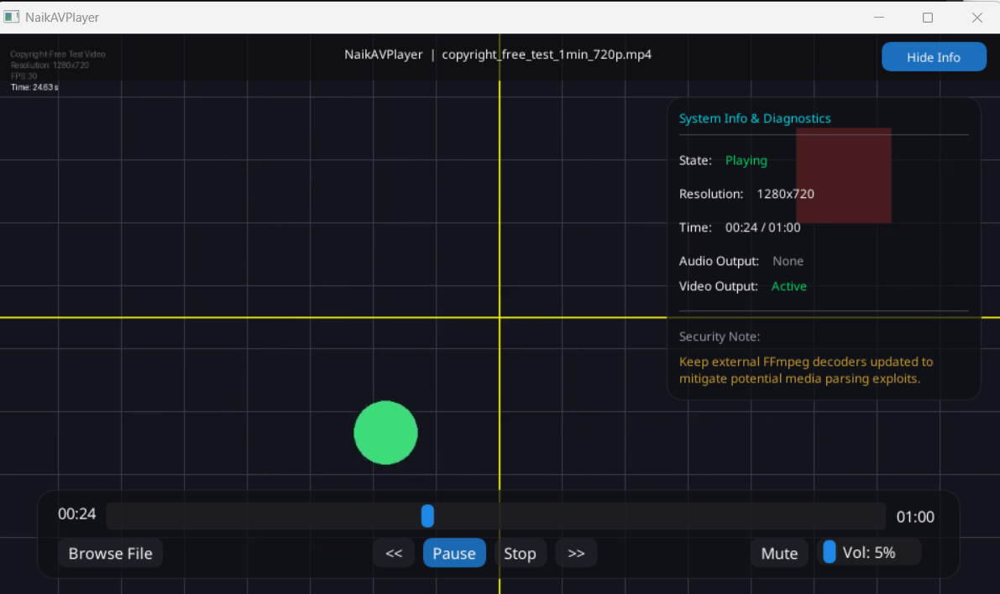
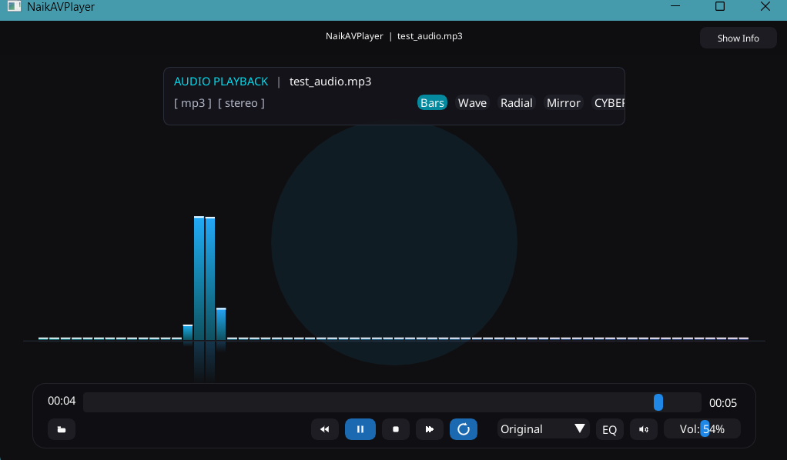

# NaikAVPlayer

[](https://github.com/sanjeev-naik/NaikAVPlayer/actions/workflows/ci.yml)
[](https://codecov.io/gh/sanjeev-naik/NaikAVPlayer)
[](LICENSE)

NaikAVPlayer is a native, multi-threaded C++17 media engine and video player built using raw FFmpeg APIs, SDL3, and Dear ImGui. It performs container parsing, hardware/software video decoding, sample-accurate audio resampling, and clock synchronization directly using GPU-mapped texture updates without intermediate heavy frameworks. It achieves low-latency seeking and sub-10ms audio-video clock synchronization using dedicated worker threads coordinated through bounded blocking queues and a lock-free Single Producer Single Consumer (SPSC) ring for hot-path telemetry.


---


---

## Key Features

- **Symmetric Low-Latency Seeking:** Rapid keyframe seek operations flushing packet queues and decoding pipelines under 80ms.
- **Stall-Proof Pipeline Backpressure:** Producer threads never block indefinitely on a full queue — bounded-wait pushes fall back to dropping the oldest queued item once a timeout elapses, so a paused audio device, a stalled render loop, or a wedged decoder can never freeze the single demuxer thread that feeds both the video and audio queues.
- **Dynamic Hardware Decoder Fallback:** Tries platform-specific hardware decoders (D3D11VA, DXVA2, QSV, CUVID on Windows; V4L2M2M, VAAPI, QSV, CUVID on Linux), falling back dynamically to software H.264 decoding if hardware context allocation fails or encounters runtime surface mapping errors.
- **Sub-10ms Audio-Video Synchronization:** Reconstructs the audio clock sample-accurately from PCM sample offsets to maintain A/V drift under 10ms.
- **Fullscreen, Cursor Auto-Hide & Usability Gestures:** Fullscreen mode toggling via `F11`, `Alt+Enter`, or double-clicking anywhere on the video canvas; automatic cursor and controls dock hiding after 2.5 seconds of playback inactivity; instant volume adjustment via `Up`/`Down` arrow keys (±5%), mouse wheel over video, or mute toggle (`M`); and auto-pausing background playback during native file explorer dialogs.
- **Lossless Video Frame Screenshot Export:** Capture and export the current video frame as a full-resolution PNG image (`S` hotkey) saved directly to the `screenshots/` directory with automatic timestamps (`NaikAVPlayer_<basename>_<YYYYMMDD_HHMMSS>_<time>.png`) using FFmpeg's native PNG encoder and `sws_scale` RGB24 conversion, accompanied by animated on-screen Toast feedback.
- **Multiple Audio Track Switching & External Audio Support:** Full multi-stream container discovery for MP4/MKV files containing multiple embedded audio tracks (e.g. multi-language English/Japanese/Hindi, Director's commentary, stereo vs 5.1/7.1 surround). Supports seamless runtime audio track switching via the dedicated `[Audio]` headphone button or `B` hotkey without stalling video playback. Includes loading external standalone audio files (`.m4a`, `.aac`, `.ac3`, `.mp3`, `.wav`, `.flac`, `.ogg`, `.opus`, `.wma`, `.mka`) with automatic demuxer clock synchronization, switching back and forth between external and embedded tracks, and stream muting/disabling.
- **Complete Subtitle Support (Internal & External):** Detects, decodes, and renders both embedded container subtitles (SRT, ASS, SSA, WebVTT, MOV Text) and external subtitle files (`.srt`, `.vtt`, `.ass`, `.ssa`, `.sub`). Features auto-detection of matching subtitle files adjacent to media, interactive track selection menu (`[CC]` button in controls dock), on-the-fly subtitle cycling (`V`), millisecond-accurate sync timing delay offset adjustments (`G` / `H`), and clean on-screen rendering with dark backdrop contrast overlays.
- **Multichannel Audio Preservation:** Reads the source stream's real channel layout and drives 2.1/5.1/5.1(back)/7.1 straight through to a matching SDL3 multichannel device instead of always downmixing to stereo, with a device-native-channel check that flags when the OS is silently downmixing anyway, and a manual Auto / Force Stereo / Virtual Surround override.
- **Virtual Surround & 3D Spatial Audio:** `VIRTUAL_SURROUND` folds a discrete 2.1/5.1/5.1(back)/7.1 source down to stereo with positional delay/filter cues (`SpatialDownmixer`) instead of a flat downmix, so surround content stays spatial on headphones/stereo speakers; a separate "3D Surround" ambience synthesizer (`Surround3D`) adds a similar spatial feel to any plain stereo source, and a mid-side Stereo Widener adjusts the perceived image width independently of either.
- **Studio DSP Chain:** Live-adjustable true parametric 5-band EQ (frequency, Q, and gain all independently adjustable per band), a noise gate/expander, a soft-knee full-band compressor plus an independent 3-band multiband compressor (two crossover-split bands, each with its own threshold/ratio), a lookahead peak limiter (delay-line based, so the gain envelope reduces *ahead of* fast transients instead of only clamping after the fact), and a Linkwitz-Riley bass-management crossover — LFE tone control by default, with an optional true bass-redirect mode that highpasses every other channel and sums exactly what was removed into the LFE channel. A left/right balance control and 9 presets (see below) round out the chain. Runs on a float-internal signal path — every stage is a true no-op until explicitly configured.
- **EBU R128 Loudness Normalization — Real-Time, Two-Pass, or Tag-Based:** Real-time integrated/momentary LUFS metering with a smoothed gain correction toward a configurable target. A file is also pre-scanned once (decode-only, no video, no device I/O) before playback starts and on seek, so the correct gain applies from the very first sample instead of ramping in — see `naikav::dsp::prescanIntegratedLufs()`. When a file already carries a ReplayGain or EBU R128 gain tag (`REPLAYGAIN_TRACK_GAIN`/`R128_TRACK_GAIN`, from taggers like `mp3gain`/`rsgain`/`loudgain` or the encoder itself), that's used instead — no decoding needed at all, and at least as accurate since it's exactly what already measured the whole file. See `naikav::dsp::readTaggedLoudnessAsLufs()`.
- **Automatic Genre-Based Presets (opt-in):** When enabled, reads a file's genre tag on open and applies a matching preset (e.g. "Podcast"/"Speech" → Podcast, "Soundtrack" → Cinema) via simple keyword matching — see `naikav::dsp::presetForGenreTag()`.
- **Dedicated Audio-Only Playback & Real-Time Visualizer:** Native, sample-accurate playback pipeline for audio-only formats (MP3, AAC, FLAC, OGG, WAV, etc.) with automatic exclusion of embedded album artwork (`AV_DISPOSITION_ATTACHED_PIC`) from the video pipeline. When an audio file is loaded, a hardware-accelerated, real-time reactive audio visualizer automatically takes over the main viewport with 4 visualization styles (Neon Equalizer Bars with falling peak physics and reflections, Smooth Flowing Waveform, Radial Audio Disc, and Mirrored Stereo Spectrum) and 4 color palettes (Cyberpunk, Sunset Fire, Mint Emerald, Electric Violet).
- **Real-Time Spectrum Analyzer & Waveform Snapshots:** Opt-in FFT-based magnitude spectrum visualizer (`SpectrumAnalyzer`, 1024-point hand-rolled radix-2 FFT, Hann-windowed, frame-smoothed) and time-domain oscilloscope snapshotting reading the final post-DSP-chain signal — display only, never modifies the audio.
- **High-Quality Resampling & Dither:** libsoxr resampling engine (in place of swresample's default), with a user-facing Low/Medium/High/Very High quality selector (soxr's `precision` bits-of-precision option), plus triangular (TPDF) dither applied only at the final truncation. Resampler buffering latency is handled explicitly, so raising the quality tier never trades clean audio for precision.
- **Audio Underrun Instrumentation:** Always-on counters (M10-M12) track how often the SDL audio callback has to emit silence because no samples were available — the direct, quantitative measure of playback glitching, and the signal `SDL_GetAudioStreamQueued()` cannot provide in this architecture. A standalone smoke test (`tests/audio_underrun_smoke.cpp`) drives the real audio path against a real file and attributes any underrun to a specific cause.
- **Selectable Output Format & Device:** 16-bit integer (default), 32-bit integer, or 32-bit float device output (the internal pipeline is always float — 32-bit float skips dithering/truncation entirely), and a playback device picker (`AudioDecoder::enumeratePlaybackDeviceNames()`) instead of always using the OS default device.
- **DSP Presets & Persistent Settings:** One-click Flat / Music / Cinema / Night / Podcast / Gaming / Live / Bass Boost / Vocal Boost presets for the whole audio chain, all settings (resolution, DSP, loudness, output format/device, channel selection) surviving restarts via `player_settings.txt`.
- **Dynamic Resolution Scaling:** Real-time playback scaling supporting dynamic output resolution selection (Original source, 360p, 480p, 720p, 1080p, 1440p, 4K) from the UI dropdown to optimize GPU upload bandwidth.
- **Variable Playback Speed Control (0.25x - 2.0x):** Real-time, pitch-preserving playback rate adjustments using SDL3 dynamic audio stream frequency resampling (`SDL_SetAudioStreamFrequencyRatio`) synchronized with master audio/video clock pacing. Accessible via a dedicated Speedometer icon button in the controls dock, popup slider with preset buttons, fine-tuning buttons, and keyboard hotkeys (`[` / `]` / `Backspace`).
- **Auto-Pause on File Selection:** Automatically pauses background audio and video playback whenever the native file explorer dialog is opened, preserving the exact playback position and keeping the audio silent while browsing.
- **Software Volume Attenuation:** Scalable audio output level adjustments with memcpy/memset bypasses for 100% and 0% volume states.
- **Loop Playback:** Wraparound seek to 0.0 upon reaching end-of-file for continuous playback, toggleable via the controls dock `[Loop]` icon button and `L` hotkey.
- **Playlist & Auto-Advance:** Build a queue of local media files — multi-select "Add Files" dialog, non-recursive "Add Folder" directory scan, or dropping more than one file onto the window at once — with drag-to-reorder, per-row removal, and double-click-to-play, via the `[Playlist]` button in the controls dock or the `P` hotkey. `Off` / `All` / `One` repeat modes plus a Shuffle toggle govern auto-advance once playback naturally reaches end-of-file, independent of the per-file `[Loop]` button above (which always just repeats the current file and takes priority while it's on). Playlist contents and repeat/shuffle state persist across restarts as standard M3U8 (`playlist.m3u8`).
- **Native File Picker:** Cross-platform native file picker integration using `nativefiledialog-extended` (NFD) on Win32 and GTK3/Portal backends.
- **Pipeline Diagnostics & System Info HUD:** Real-time overlay (`--metrics` or `D` key) displaying active player states, media telemetry (native vs. playback resolution, pixel format, hardware vs. software decoder type), Color & HDR pipeline characteristics (Color Space, Primaries, TRC, Range, Chroma Subsampling, Bit Depth, HDR10/HDR10+/Dolby Vision/HLG standard), pipeline queue depth levels, decode/render frame pacing budgets, and rolling clock synchronization offsets.
- **Audio Processing Panel:** Dedicated overlay (`A` key) for the full DSP chain (EQ, noise gate, compressor, multiband compressor, limiter, crossover, loudness, 3D surround, widener, balance), a live FFT spectrum visualizer, plus channel/output-device/bit-depth/resampler-quality selection, separate from the diagnostics HUD.
- **Translucent User Interface:** ImGui-based desktop interface using bundled Noto Sans typography.

---

## Architecture

NaikAVPlayer follows a multi-threaded media player design with decoupled worker threads coordinated through bounded thread-safe queues and an audio-master clock reference.

### Source Layout

Sources are grouped by subsystem under `src/`, and headers are included by that path (e.g. `#include "audio/dsp/DspChain.hpp"`):

```text
src/
├── app/       main.cpp — entry point, SDL window/event loop, render loop, CLI flags
├── audio/     AudioDecoder.{hpp,cpp}, AudioTrack.hpp — decode, resample, SDL callback, track models, output selectors
│   └── dsp/   header-only DSP module (see Audio DSP & Loudness Pipeline below)
├── core/      ThreadSafeQueue.hpp, MetricRing.hpp, PipelineMetrics.hpp
├── media/     Demuxer.{hpp,cpp} — packet reading, multi-stream track enumeration and routing
├── player/    PlayerController.{hpp,cpp} — state machine, track switching, seeking, settings persistence
├── playlist/  header-only Playlist module (queue, repeat/shuffle, M3U8 I/O — see Playlist & Auto-Advance below)
├── subtitle/  SubtitleDecoder.{hpp,cpp}, SubtitleTrack.hpp — decoding, parsing, sync, sanitization
├── ui/        PlayerUI.{hpp,cpp} — ImGui controls dock, diagnostics HUD, audio panel, subtitle overlay
└── video/     VideoDecoder.{hpp,cpp}, FrameExporter.hpp — HW/SW decode, frame conversion, PNG screenshot export
```


### Thread Model

```text
  ┌──────────────────┐
  │ Media File/Stream│
  └────────┬─────────┘
           │
           ▼
  ┌──────────────────────────────────────────────────────────┐
  │                      Demuxer Thread                      │
  └───────┬─────────────────────┬────────────────────┬───────┘
          │ video packets       │ audio packets      │ subtitle packets
          ▼                     ▼                    ▼
  ┌──────────────┐      ┌──────────────┐     ┌──────────────┐
  │ Video Packet │      │ Audio Packet │     │Subtitle Queue│
  │ Queue (100)  │      │ Queue (150)  │     │  (50 pkts)   │
  └───────┬──────┘      └───────┬──────┘     └───────┬──────┘
          │                     │                    │
          ▼                     ▼                    ▼
  ┌──────────────┐      ┌──────────────┐     ┌──────────────┐
  │Video Decoder │      │Audio Decoder │     │  Subtitle    │
  │Thread (HW/SW)│      │  (SDL3 Audio)│     │Decoder/Parser│
  └───────┬──────┘      └───────┬──────┘     └───────┬──────┘
          │ decoded frames      │ PCM Audio & PTS    │ events
          ▼                     ▼                    │
  ┌──────────────┐      ┌──────────────┐             │
  │Decoded Frame │      │ Audio Master │             │
  │  Queue (8)   │      │    Clock     │             │
  └───────┬──────┘      └───────┬──────┘             │
          │                     │                    │
          └──────────────┬──────┴────────────────────┘
                         │
                         ▼
  ┌──────────────────────────────────────────────────────────┐
  │                   Main / Render Loop                     │
  │  ┌────────────────────────────────────────────────────┐  │
  │  │ Dequeue Frames ──► Query Master Clock (A/V Sync)   │  │
  │  │                            │                       │  │
  │  │                            ▼                       │  │
  │  │ Drop Late Frames ──► GPU YUV Texture Upload & UI   │  │
  │  │                            │                       │  │
  │  │                            ▼                       │  │
  │  │ Subtitle Overlay Match ──► Render Contrast Backdrop│  │
  │  └────────────────────────────────────────────────────┘  │
  └──────────────────────────────────────────────────────────┘
```

- **Demuxer Thread**: Reads raw packets via `av_read_frame` and routes them into bounded `ThreadSafeQueue<AVPacket*>` instances (video capacity: 100 packets, audio capacity: 150 packets, subtitle capacity: 50 packets). Pushes never block indefinitely — see [Stall-Proof Queue Backpressure](#stall-proof-queue-backpressure-deadlock-prevention) below.
- **Video Decoder Thread**: Background worker thread that pops packets from the video queue, decodes them (via hardware or software fallback), converts frames, and pushes them into the bounded `m_decodedFrameQueue` (capacity: 8 frames), using the same bounded-wait backpressure.
- **Audio Decoding**: Executed sample-accurately inside the SDL3 Audio Stream callback thread. It pulls packets from the audio queue, decodes them, resamples to the output layout/rate as interleaved float (`swr_convert`, libsoxr engine), runs the DSP chain and loudness normalization in place, then dithers and truncates to the device's 16-bit format — see [Audio DSP & Loudness Pipeline](#audio-dsp--loudness-pipeline) below.
- **Subtitle Decoder & Parser**: Handles container-embedded subtitle streams via FFmpeg decoders and standalone external files (`.srt`, `.vtt`, `.ass`, `.ssa`, `.sub`) parsed directly into in-memory timed events.
- **Main / Render Thread**: Dequeues decoded frames from `m_decodedFrameQueue` whose PTS matches the master clock time, matches active subtitle events against playback PTS + delay offset, updates the SDL YUV texture on the GPU, and renders the Dear ImGui interface overlay.

#### GPU-Mapped Planar YUV Uploads
Instead of performing CPU-side YUV-to-RGB color space conversion, the video decoder pipeline extracts raw YUV 4:2:0 planar frame data directly. The main thread maps this data onto a hardware-accelerated SDL3 streaming texture (`SDL_PIXELFORMAT_IYUV`) using `SDL_UpdateYUVTexture`. This uploads plane segments directly to GPU texture memory, allowing graphics hardware to handle color space conversion and scaling efficiently.

#### Dynamic Hardware Decoder Fallback
At initialization, the video decoder queries native hardware codecs (`h264_d3d11va`, `h264_dxva2`, `h264_qsv`, `h264_cuvid` on Windows; `h264_vaapi`, `h264_v4l2m2m` on Linux). If hardware initialization fails or encounters runtime frame mapping errors (e.g. running inside headless or virtualized environments), the system intercepts the error, releases the hardware context, configures software `h264`, and resubmits pending packets seamlessly.

#### Stall-Proof Queue Backpressure (Deadlock Prevention)
The demuxer thread is the single reader for both the video and audio packet queues, so a producer that blocks indefinitely on either one would silently stop delivery to both — for example, the audio queue has no active consumer while the audio device is paused (during a seek catch-up, or simply while the user has playback paused). `ThreadSafeQueue` addresses this with two non-blocking-forever push variants used throughout the pipeline instead of a plain blocking `push()`:
- **`push_wait_or_drop(value, timeout)`**: waits briefly for room, then drops the oldest queued item and pushes anyway once the timeout elapses. Used by the demuxer for both packet queues and by the video decoder thread for the decoded frame queue, so a paused consumer, a stalled render loop, or a wedged hardware decoder can never block a producer thread forever.
- **`push_drop_oldest(value)`**: never waits — drops the oldest item immediately if the queue is full. Used for audio packets while the audio device is known to be idle (paused, or mid seek catch-up), since there's no point waiting on a consumer that isn't running at all.

Both variants keep the pipeline making forward progress under any stall condition, and self-recover without needing an external nudge (such as another seek) to unblock a wedged queue.

### Audio-Master Clock Synchronization

Playback uses **audio as the master clock** whenever an audio stream is present:

```
audio_clock = base_pts_of_current_frame + (bytes_already_consumed_by_SDL / bytes_per_second)
```

`AudioDecoder::getAudioClock()` combines the PTS of the current frame with the progress of the SDL audio stream callback into that frame's buffer, delivering sub-frame timing resolution to maintain `<10ms` drift. When no audio stream is present, the engine falls back to a wall-clock `m_videoClock` driven by `std::chrono::steady_clock` deltas.

### Multichannel Output & Channel Selection

`AudioDecoder` reads the source stream's real `AVCodecContext::ch_layout` and, for layouts it can drive directly (2.1, 5.1, 5.1(back), 7.1), requests a matching multichannel `SDL_AudioSpec` instead of always downmixing to stereo. If the audio device rejects the surround request, it falls back to a stereo downmix automatically rather than failing playback.

> [!NOTE]
> A successful device open does **not** by itself prove real multichannel speakers are connected — Windows/Linux audio APIs accept a high channel-count request in shared mode and silently downmix it to whatever the physical device actually supports. NaikAVPlayer also queries the device's *native* channel count (`SDL_GetAudioDeviceFormat`) and surfaces both numbers side by side in the Audio Processing panel (`A` key), flagging when a layout labeled "5.1" is actually being downmixed by the OS. Users who know their real output is stereo can force it explicitly via the panel's Output Channels selector (`Auto` / `Force Stereo`); the choice is persisted across sessions and takes effect on the next file opened (changing channel count requires reopening the audio device, so it isn't hot-swapped mid-playback).

### Audio DSP & Loudness Pipeline

Every decoded audio buffer passes through a fixed, in-place signal chain inside the SDL3 audio callback, entirely on interleaved float samples (not the final 16-bit output format) so each stage has full headroom and precision before the very last truncation step:

```text
Decode (FFmpeg)
     │
     ▼
Resample to output rate/layout (swresample, libsoxr engine)
     │   (a 0-sample result here means the resampler is still
     │    buffering — decode another frame, never emit silence)
     ▼
DSP Chain  ── Parametric EQ (5-band biquad, freq/Q/gain all adjustable)
           ──► Noise Gate (downward expander below threshold)
           ──► Compressor (soft-knee, linked multichannel)
           ──► Multiband Compressor (3 bands, 2 crossover splits)
           ──► Limiter (lookahead delay line + fast attack, hard-ceiling backstop)
           ──► Bass-Management Crossover (Linkwitz-Riley 4th-order:
               LFE lowpass, optional highpass + redirect on other channels)
     │
     ▼
Loudness Normalization (EBU R128; real-time smoothed gain, a
whole-file prescan, or a ReplayGain/R128 tag primes the gain)
     │
     ▼
3D Surround synthesis ──► Stereo Widener ──► Balance (final output-width/pan stage)
     │
     ▼
Spectrum Analyzer (display tap -- reads the signal, never modifies it)
     │
     ▼
Final safety limiter (always-on backstop)
     │
     ▼
TPDF Dither → device-format truncation (16-bit int / 32-bit int / 32-bit float) → SDL3 device output
```

- **Float-internal, dither only at the end:** `swr_convert` outputs `AV_SAMPLE_FMT_FLT`, not the device format — every DSP stage runs at full float precision, with quantization noise (triangular/TPDF dither) introduced exactly once, at the final truncation. 32-bit float output skips that truncation/dither step entirely (see [Selectable Output Format & Device](#key-features) above).
- **Zero cost when disabled:** default settings (0 dB EQ, gate/compressor/multiband ratio 1:1, 0 dB limiter ceiling, loudness off) make each stage a true no-op — enabling the chain doesn't change the sound, or add measurable overhead, until something is actually configured.
- **True parametric EQ:** each of the 5 bands has independently adjustable center frequency, Q (bandwidth), and gain — not just gain around a fixed set of frequencies.
- **Noise gate:** a downward expander below threshold (the mirror of the compressor), with fast-open/slow-close attack-release and its own short detector-smoothing stage so a sustained tone's own zero-crossings don't chatter the gate.
- **Multiband compressor:** splits into low/mid/high bands via two Linkwitz-Riley crossover points and compresses each independently, so taming one frequency range doesn't drag the others down with it the way the single full-band compressor does.
- **Lookahead limiter:** holds a short (a few milliseconds) internal delay line so the gain-reduction envelope has time to react *before* a fast transient reaches the output, rather than only clamping it after the fact once it's already passed through at full level.
- **True bass management, optionally:** the crossover's LFE lowpass is always available; enabling bass redirect additionally highpasses every non-LFE channel and sums exactly the content removed from each into the LFE channel, for setups where the main/surround speakers can't reproduce bass well.
- **Live, thread-safe control:** `AudioDecoder::applyDspSettings()` lets the UI thread update every parameter (EQ bands, gate, compressor, multiband, limiter, crossover, loudness target, surround/widener/balance) while the SDL audio callback thread concurrently processes audio — both sides are guarded by one short-held mutex, so switching presets never blocks or glitches playback.
- **EBU R128 via FFmpeg, not a hand-rolled meter:** loudness measurement uses FFmpeg's own `ebur128` `libavfilter` filter (a minimal `abuffer → ebur128 → abuffersink` graph, reading momentary/integrated LUFS back via frame metadata) rather than a custom K-weighting/gating implementation — spec-compliance for loudness numbers matters in a way DSP *effects* don't.
- **Two-pass loudness priming:** `naikav::dsp::prescanIntegratedLufs()` decodes a file's whole audio stream once (no video, no device output) to get a stable whole-file LUFS figure before playback begins, which primes the real-time normalizer to the correct gain immediately — avoiding both the multi-second startup ramp and the reset-to-zero-gain a plain real-time meter would otherwise hit on every seek.
- **ReplayGain/R128 tag priming, when present:** `naikav::dsp::readTaggedLoudnessAsLufs()` checks for `R128_TRACK_GAIN`/`REPLAYGAIN_TRACK_GAIN` (and their `_ALBUM_` fallbacks) before falling back to the decode-based prescan above — no decoding needed at all when the tag is already there.
- **Spectrum analyzer:** `SpectrumAnalyzer` downmixes the final signal to mono, accumulates it into a ring buffer, and runs a hand-rolled 1024-point radix-2 FFT every full block (~21ms at 48kHz), Hann-windowed and frame-to-frame smoothed for a stable display. A read-only tap (via a self-synchronized snapshot getter, no shared locking needed) -- it never touches the signal it's analyzing.
- **Presets & persistence:** Flat / Music / Cinema / Night / Podcast / Gaming / Live / Bass Boost / Vocal Boost presets (Audio Processing panel, `A` key) apply a canned combination of every parameter in one step, optionally auto-selected by a file's genre tag; all settings persist to `player_settings.txt` across sessions.

> [!NOTE]
> **Not implemented (deliberately scoped out):**
> - **HRTF/binaural rendering** — the existing "3D Surround"/Virtual Surround features are hand-rolled ambience/positional-cue synthesis, explicitly *not* real HRTF (no licensed decoder or measured head-related impulse response data involved, and this project doesn't vendor one). Real HRTF rendering needs an actual measured HRIR dataset (e.g. MIT KEMAR, SADIE, CIPIC) to convolve against, which is a data/licensing decision for a future contribution, not something fabricated here.
> - **Gapless playback & crossfade** — a real playlist/track-queue engine now exists (see [Playlist & Auto-Advance](#playlist--auto-advance) below), but true sample-accurate gapless transitions and crossfade need cross-instance `AudioDecoder` handoff and a crossfade DSP stage on top of it, which is a larger architectural addition than the rest of the DSP chain above and is left for a future iteration. Today's playlist auto-advance opens and starts the next file the same way manually opening a new file does (brief re-init gap, no crossfade).

### Dedicated Audio-Only Playback & Real-Time Visualizer

NaikAVPlayer provides a dedicated audio-only playback mode that activates automatically whenever a media file contains audio streams without a motion video stream (including MP3, AAC, FLAC, OGG, WAV):
- **Cover Art Filtering (`AV_DISPOSITION_ATTACHED_PIC`)**: Embedded album artwork (ID3 APIC / attached pictures) is filtered out from video stream indexing so audio-only files immediately engage the visualizer rather than stalling the video decoder pipeline.
- **Timebase-Accurate Audio Clock**: Directly converts decoded audio frame timestamps from the stream timebase (`m_timeBase`) into seconds for sample-accurate clock progression.
- **Hardware-Accelerated Reactive Visualizer**: Renders 4 distinct visualization styles (Neon Equalizer Bars with falling peak physics and reflections, Smooth Flowing Waveform, Radial Audio Disc, Mirrored Stereo Spectrum) across 4 color palettes (Cyberpunk, Sunset Fire, Mint Emerald, Electric Violet) using Dear ImGui `ImDrawList` primitives.

### Subtitle Pipeline (Internal & External)

- **Embedded Subtitle Detection**: Demuxes container-embedded subtitle streams (SRT, ASS/SSA, WebVTT, MOV Text) into bounded queues synchronized to video presentation timestamps.
- **External Sidecar Loading**: Supports loading standalone subtitle files (`.srt`, `.vtt`, `.ass`, `.ssa`, `.sub`) with automatic adjacent-file discovery and instant random seeking via in-memory event caching.
- **Text Sanitization & Contrast Rendering**: Strips raw ASS override styling tags and dialogue headers while rendering clean, centered text over a translucent dark rounded backdrop box (`rgba(5, 5, 8, 0.78)`).
- **Millisecond-Accurate Sync Offset**: Real-time delay adjustment in 50ms increments via `G` / `H` hotkeys or the `[CC]` controls menu.

### Multiple Audio Track Switching & External Audio

- **Multi-Stream Audio Discovery**: Discovers all embedded audio streams in MP4/MKV containers, exposing language tags, titles, codecs, channel layouts, and sample rates.
- **Runtime Track Switching**: Hot-swaps the active audio stream via `B` or the `[Audio]` menu without dropping video frames or interrupting video playback.
- **External Audio Demuxing**: Concurrently demuxes external audio files (`.m4a`, `.aac`, `.ac3`, `.mp3`, `.wav`, `.flac`, `.ogg`, `.opus`, `.wma`, `.mka`) via a dedicated secondary demuxer thread synchronized with the master video timeline.

### Frame Screenshot Export & Usability Pipeline

- **PNG Screenshot Capture (`FrameExporter`)**: Extracts the current presentation `AVFrame`, converts it to RGB24 via `sws_scale`, and encodes it to a PNG image using FFmpeg's native PNG encoder. Output files are saved into `screenshots/NaikAVPlayer_<basename>_<YYYYMMDD_HHMMSS>_<time>.png`.
- **Toast Notifications**: Floating on-screen feedback toasts at the bottom/top of the screen for track changes, delay adjustments, screenshot exports, loop toggling, and errors.
- **Auto-Hide Controls & Cursor**: Controls dock and mouse cursor fade out after 2.5 seconds of inactivity during video playback and restore upon any mouse or keyboard input.

### Playlist & Auto-Advance

`PlayerController` owns a header-only `naikav::playlist::Playlist` (`src/playlist/`, no SDL/FFmpeg/ImGui dependency) tracking the queued items, `RepeatMode` (`Off`/`All`/`One`), and shuffle state. The current item is tracked by a stable id assigned on insert rather than a raw index, so it survives reordering and removal of other items without index-arithmetic bookkeeping.

- **Auto-advance**: `PlayerController::pollPlaylistAutoAdvance()`, called once per frame from the main loop, checks for the `ENDED` state (see [State Machine Transitions](#state-machine-transitions) below) and, if reached, advances via `Playlist::next()` and opens/plays the result the same way any other file open does — never touching the packet queues directly. `next()`/`previous()` automatically skip entries marked invalid (e.g. a file referenced by a loaded M3U that's since been moved or deleted) instead of getting stuck on them.
- **Loop interaction**: the per-file `[Loop]` toggle is unchanged and independent — playback never reaches `ENDED` while it's on (it wraps via `instantSeek(0.0)` first), so the playlist's own repeat mode only takes effect once `[Loop]` is off.
- **Opening a file resets the playlist to just that file**: `openFile(path, resetPlaylist = true)` is the default for the CLI argument, a single drag-and-drop, and the "Open File" dialog, so what's "playing" and what's "in the playlist" never disagree. Playlist-driven navigation calls `openFile(path, false)` instead.
- **Multi-file drag-and-drop**: SDL3 delivers one drop event per dropped file within the same poll batch; these are now collected and, if more than one, appended to the playlist as a batch (dropping exactly one file keeps the original single-file-open behavior).
- **Persistence**: playlist contents save as `playlist.m3u8` (standard M3U8, so it also opens correctly in other players); the current index, repeat mode, and shuffle flag are three additional `key=value` lines in `player_settings.txt`, following that file's existing forward/backward-compatible format. Both save immediately on every playlist mutation, and load once at startup without auto-playing.

### State Machine Transitions
* **`UNINITIALIZED`**: Initial state. Loading media starts background demuxing and transitions to `OPENED`.
* **`OPENED`**: Media metadata loaded; decoders initialized; initial frame rendered. Triggering `play()` transitions to `PLAYING`.
* **`PLAYING`**: Audio output unpaused; main loop syncs video frames to the master clock.
* **`PAUSED`**: Audio device paused; current clock frozen.
* **`ENDED`**: Demuxer hits EOF and packet queues drain. If **Loop Mode** is enabled, reaching EOF directly invokes `seek(0.0)` to restart playback continuously; otherwise, if a playlist item follows (per its repeat/shuffle state), `pollPlaylistAutoAdvance()` opens and plays it on the next frame.
* **`ERROR_STATE`**: Entered on demuxing/decoder failure, releasing resources safely.

---

## Linux Binary Compatibility Limitation & Source Build Strategy

> [!IMPORTANT]
> **Linux Release Binary Limitation:**
> The pre-built Linux x86_64 release binaries generated by the CI environment (built on modern Ubuntu runners) are **not currently published** to GitHub Release artifacts. 
> 
> Due to differences in C runtime library symbol versions (specifically `glibc` requirements such as `GLIBC_2.34`+), C++ standard libraries (`libstdc++.so.6`), GTK3 UI dependencies, and graphics stack interfaces, binaries built on modern CI environments may fail to execute on older Linux distributions (e.g., Ubuntu 20.04/22.04 LTS, older Debian releases, or enterprise Linux distros).
> 
> **Action Required for Linux Users:**
> Linux users should currently **build NaikAVPlayer from source** on their target operating system to guarantee 100% ABI and library compatibility.
> 
> **Future Improvement Roadmap:**
> Linux release binary artifacts will be re-enabled once a reproducible, universally portable packaging build system is implemented (for example, using an older baseline toolchain container, AppImage packaging, or Flatpak binaries).

---

## Build & Local Cross-Compilation Guide

NaikAVPlayer supports building natively from source across host operating systems as well as cross-compiling for target architectures.

### 1. Supported Host Platforms & Toolchain Prerequisites

| Host OS | Compiler Requirement | Build System | Package Manager Setup |
| :--- | :--- | :--- | :--- |
| **Ubuntu / Debian** | GCC 9+ / Clang 10+ | CMake 3.16+ | `apt-get` |
| **Fedora / RHEL** | GCC 9+ | CMake 3.16+ | `dnf` |
| **Arch Linux** | GCC 13+ / Clang 16+ | CMake 3.16+ | `pacman` |
| **Windows** | MSVC 2019+ or MinGW-w64 GCC | CMake 3.16+ | Visual Studio / MSYS2 |


#### Dependency Installation

**Ubuntu / Debian (including Raspberry Pi OS):**
```bash
sudo apt-get update
sudo apt-get install -y \
  build-essential \
  cmake \
  pkg-config \
  libavcodec-dev \
  libavformat-dev \
  libavutil-dev \
  libswscale-dev \
  libswresample-dev \
  libavfilter-dev \
  libgtk-3-dev \
  libxss-dev \
  libasound2-dev \
  libpipewire-0.3-dev \
  ccache
```
*(SDL3 v3.4.0, Dear ImGui v1.91.9, and nativefiledialog-extended v1.2.1 are automatically fetched and compiled from source via CMake FetchContent).*

> [!IMPORTANT]
> **`libasound2-dev` / `libpipewire-0.3-dev` are required, not optional.** SDL3 detects available audio backends via `pkg-config` at CMake configure time. If neither package (nor `libpulse-dev`) is installed, SDL3 silently builds with only its `dummy`/`disk` audio drivers — the build succeeds, but the app fails at launch with `Could not initialize SDL3: No available audio device`. This is a Linux-only failure mode: Windows audio (WASAPI) ships inside the OS SDK, so there is no equivalent dev package to forget. CMake now checks for this at configure time (see [Troubleshooting in help.md](help.md#9-troubleshooting)) and fails fast with instructions instead of producing a silently broken build.

**Fedora / RHEL:**
```bash
sudo dnf install -y \
  gcc-c++ \
  cmake \
  pkg-config \
  ffmpeg-free-devel \
  gtk3-devel \
  libXScrnSaver-devel \
  alsa-lib-devel \
  pipewire-devel \
  ccache
```

**Arch Linux:**
```bash
sudo pacman -S --needed \
  base-devel \
  cmake \
  pkgconf \
  ffmpeg \
  gtk3 \
  alsa-lib \
  libpipewire \
  ccache
```

**Windows (Native MinGW-w64):**
Ensure CMake 3.16+ and MinGW-w64 GCC are present in `PATH`. CMake automatically downloads prebuilt FFmpeg shared binaries during configuration.

---

### 2. Native Build Workflows

#### Workflow 1: Development Build (`Debug`)
Use for active daily development, GDB/LLDB debugging, and running unit test suites:

```bash
# 1. Configure for local development (Debug)
cmake -B build-debug -DCMAKE_BUILD_TYPE=Debug

# 2. Build executable & test suite
cmake --build build-debug -j$(nproc)

# 3. Execute unit tests
ctest --test-dir build-debug --output-on-failure
```

*For Windows (MinGW):*
```powershell
cmake -B build-debug -G "MinGW Makefiles" -DPLATFORM=WINDOWS -DCMAKE_BUILD_TYPE=Debug
cmake --build build-debug
```

#### Workflow 2: Production Build (`Release`)
Generates optimized binaries (`-O3`) matched specifically to your local Linux system's `glibc` and library environment:

```bash
# 1. Configure production release
cmake -B build -DCMAKE_BUILD_TYPE=Release -DPLATFORM=LINUX

# 2. Compile release executable
cmake --build build -j$(nproc)
```

*For Windows (MSVC Native):*
```cmd
cmake -B build -G "Visual Studio 17 2022" -A x64 -DPLATFORM=WINDOWS
cmake --build build --config Release
```

*For Windows (MinGW):*
```powershell
cmake -B build -G "MinGW Makefiles" -DPLATFORM=WINDOWS -DCMAKE_BUILD_TYPE=Release
cmake --build build
```

---

### 3. Local Cross-Compilation Guides

NaikAVPlayer can be cross-compiled locally from a single Linux host machine for target hardware architectures or other operating systems.

#### A. Cross-Compiling for ARM64 / Raspberry Pi (`aarch64-linux-gnu`)

To build binaries for ARM64 targets (e.g. Raspberry Pi 4/5 or ARM64 single-board computers) from an x86_64 Linux host:

1. **Install Cross-Toolchain (Host):**
   ```bash
   sudo apt-get install -y gcc-aarch64-linux-gnu g++-aarch64-linux-gnu
   ```
2. **Configure & Cross-Compile:**
   ```bash
   cmake -B build-arm64 \
     -DCMAKE_SYSTEM_NAME=Linux \
     -DCMAKE_SYSTEM_PROCESSOR=aarch64 \
     -DCMAKE_C_COMPILER=aarch64-linux-gnu-gcc \
     -DCMAKE_CXX_COMPILER=aarch64-linux-gnu-g++ \
     -DPLATFORM=LINUX \
     -DNAIKAV_FORCE_BUNDLED_FFMPEG=OFF
   
   cmake --build build-arm64 -j$(nproc)
   ```

#### B. Cross-Compiling Windows Binaries on Linux (MinGW-w64)

To build native Windows 64-bit `.exe` binaries on a Linux workstation:

1. **Install MinGW Toolchain (Host):**
   ```bash
   sudo apt-get install -y mingw-w64
   ```
2. **Configure & Cross-Compile:**
   ```bash
   cmake -B build-windows \
     -DPLATFORM=WINDOWS \
     -DCMAKE_SYSTEM_NAME=Windows \
     -DCMAKE_C_COMPILER=x86_64-w64-mingw32-gcc \
     -DCMAKE_CXX_COMPILER=x86_64-w64-mingw32-g++
   
   cmake --build build-windows -j$(nproc)
   ```

> **Advanced Build Flags**: Additional CMake options are supported for analysis across build configurations:
> `-DENABLE_SANITIZERS=ON` (ASan/UBSan, default `OFF`), `-DENABLE_TSAN=ON` (ThreadSanitizer, default `OFF`),
> `-DTREAT_WARNINGS_AS_ERRORS=OFF` (`-Werror`, default `ON`), `-DENABLE_COVERAGE=OFF` (gcov/lcov
> instrumentation, default `ON`), `-DNAIKAV_FORCE_BUNDLED_FFMPEG=OFF` (use the system FFmpeg instead of the
> downloaded prebuilt one), plus the `RelWithDebInfo` and `MinSizeRel` build types.

---

### Install & Uninstall (Linux)

**Install to `/usr/local/`:**
```bash
sudo cmake --install build
```

**Uninstall:**
```bash
sudo cmake --build build --target uninstall
```

---

## Usage Guide

**Launch with media file argument:**

- **Windows (PowerShell):**
  ```powershell
  .\build\NaikAVPlayer.exe "C:\Path\To\video.mp4"
  ```
- **Linux:**
  ```bash
  ./build/NaikAVPlayer "/home/user/Videos/video.mp4"
  ```

**Launch with Telemetry profiling HUD enabled:**
```bash
./build/NaikAVPlayer --metrics "/home/user/Videos/video.mp4"
```

**Launch with console log output (Windows):**
```bash
./build/NaikAVPlayer.exe --console "/home/user/Videos/video.mp4"
```
The Windows build is a GUI-subsystem executable with no console of its own, so
its log output is discarded by default. `--console` attaches it to the terminal
that launched it. Opt-in by design: automatic console attachment at startup
matches a console-hiding pattern that generic antivirus heuristics flag. No
effect when launched by double-click, and ignored on Linux.

### Keyboard Controls & Gestures

| Key / Gesture | Action |
| :--- | :--- |
| **`Spacebar`** | Toggle Play / Pause |
| **`F11`** / **`Alt+Enter`** | Toggle Fullscreen Mode |
| **`Double-Click`** (on video) | Toggle Fullscreen Mode |
| **`M`** | Toggle Audio Mute / Unmute |
| **`Up Arrow`** / **`Down Arrow`** | Increase / Decrease Volume (±5%) |
| **`Mouse Wheel`** (over video) | Adjust Volume Up / Down (±5%) |
| **`S`** | Capture Screenshot / Export Current Video Frame as PNG |
| **`B`** | Cycle Audio Tracks (Off -> Embedded -> External -> Off) |
| **`V`** | Cycle Subtitle Tracks (Off -> Embedded -> External -> Off) |
| **`G`** / **`H`** | Adjust Subtitle Synchronization Delay (-50ms / +50ms) |
| **`Left Arrow`** / **`Right Arrow`** | Seek backward / forward by 10 seconds |
| **`[`** / **`]`** | Decrease / Increase playback speed by 0.25x (0.25x – 2.0x) |
| **`Backspace`** | Reset playback speed to normal (1.0x) |
| **`L`** | Toggle Continuous Loop Mode |
| **`P`** | Toggle Playlist Panel |
| **`Delete`** (in Playlist panel) | Remove selected item from playlist |
| **`D`** | Toggle Diagnostics HUD & Telemetry Metrics |
| **`A`** | Toggle Audio Processing Panel (EQ, Noise Gate, Compressor, Multiband, Limiter, Crossover, Loudness, Surround, Balance, Channel/Device/Format Selection) |
| **`Escape`** | Exit Fullscreen (if in fullscreen) or Exit Application |


---

## Release Packaging & Compliance

Release packages generated and published by the CI/CD pipeline (`NaikAVPlayer-windows-x64`) are validated for full open-source redistribution compliance.

The Windows release is built with the **native MSVC toolchain on a Windows runner**, not MinGW cross-compiled from Linux: MinGW PE binaries trip generic antivirus heuristics, while MSVC output trips far fewer and supports Control Flow Guard. It links the static CRT (`/MT`), so neither a VC++ redistributable nor MinGW's `libwinpthread` is bundled.

*(Note: Linux release binary artifact uploads are currently suspended until a portable AppImage/containerized build process is available. Windows release executables continue to be published — uploads run only for `release*` branches).*

Every published release package archive includes:
- **Executable**: `NaikAVPlayer.exe` (or local native `NaikAVPlayer`)
- **Dynamic Libraries**: Bundled shared libraries (`.dll` or `lib/*.so*`)
- **Licenses Directory**: Complete `licenses/` and `LICENSES/` folder containing project and third-party license text files:
  - Project `LICENSE` (MIT License)
  - `LICENSE.lgpl-3` & `FFMPEG_CREDITS.txt` (FFmpeg LGPL v3 -- this build uses `--enable-version3`; also credits the bundled libsoxr resampler and the `avfilter`/`ebur128` loudness metering it ships)
  - `LICENSE.sdl3` (SDL3 Zlib License)
  - `LICENSE.imgui` (Dear ImGui MIT License)
  - `LICENSE.nfd` (nativefiledialog-extended Zlib License)
  - `LICENSE.winpthread` (MinGW Winpthread License — retained for locally MinGW-built binaries; not applicable to the MSVC release build above)
- **Documentation**: `README.md` and `help.md`
- **Assets**: Fonts and icons in `assets/`

Automated CI package compliance verification asserts that the executable, `LICENSE`, `README.md`, `help.md`, and non-empty `licenses/` **and** `LICENSES/` directories are all present before publishing artifacts.

---

## License & Attributions

NaikAVPlayer is released under the **[MIT License](LICENSE)**.

Third-party component licensing:
- **FFmpeg** (n8.1.2): Licensed under **LGPL v3** (this vendored build was compiled with `--enable-version3`; see [`licenses/FFMPEG_CREDITS.txt`](licenses/FFMPEG_CREDITS.txt) and [`licenses/LICENSE.lgpl-3`](licenses/LICENSE.lgpl-3))
- **libsoxr** (SoX Resampler, bundled inside the FFmpeg build above): Licensed under **LGPL v2.1+** — used as swresample's resampling engine; see [`licenses/FFMPEG_CREDITS.txt`](licenses/FFMPEG_CREDITS.txt) for details. Not shipped as a separate DLL, and licensed independently of the LGPL v3 term above (it wasn't compiled with any GPLv3-requiring option).
- **SDL3** (v3.4.0): Licensed under the **Zlib License**
- **Dear ImGui** (v1.91.9): Licensed under the **MIT License**
- **nativefiledialog-extended** (v1.2.1): Licensed under the **Zlib License**
- **Noto Sans Fonts**: Licensed under the **SIL Open Font License 1.1**
